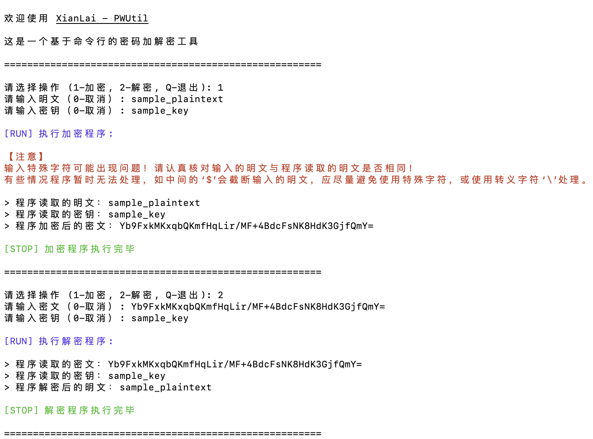

# XianLai - PWUtil

一个基于命令行的密码加解密工具

 

中文 | [English](README_EN.md)

坚持不容易，请给作者点 ⭐️Star⭐️ 鼓励鼓励

---

## 简介

每个人在生活和工作中可能用到很多密码，比如银行卡密码、电子邮箱密码、电脑登陆密码、APP 登陆密码、各个网站密码等等。记住这么多密码实在是有难度，有些密码很久才使用一次更是增加了遗忘的可能性。为了降低记忆的难度，可以在所有的地方都只使用同一个或少数几个密码。但在实际上这样做并不可行，因为每个地方对密码的规则要求不一样，比如某些地方需要包含特殊字符而其他地方不能有特殊字符。并且你无法同时信任同一个密码在所有地方都是安全的，一旦某个地方泄露了，其他所有使用这个密码的地方都不安全了。

降低记忆难度的另一个方法就是把这些密码写下来到笔记本中或保存到某个载体上。这时候需要对密码进行加密编码处理，不应该直接记录明文信息，并且要求可以把加密后的编码在需要使用时可以还原成原本的密码。**XianLai - PWUtil** 就是这样的一个基于命令行提供加密解密功能的工具。用户可以用命令行工具运行程序，根据提示进行快捷的操作。

## 效果预览



## 使用方法

### 脚本说明

- `pwutil-zh`：中文脚本，支持 macOS 和 Linux 
- `pwutil-en`：英文脚本，支持 macOS 和 Linux 
- `pwutil-zh.bat`：中文脚本，支持 Windows
- `pwutil-en.bat`：英文脚本，支持 Windows

### 在 macOS / Linux 系统中使用（推荐）

1. 前提是已经安装和配置好 Java / JDK 运行环境（建议 17 及以上）。
2. 下载程序`pwutil.jar`和中文脚本`pwutil-zh`在同一个目录下。
3. 进入脚本所在目录，执行以下命令授予脚本可执行权限：

```shell
chmod +x ./pwutil-zh
```

4. 执行以下命令运行脚本，根据提示信息选择操作类型、输入加密解密数据即可执行程序：

```shell
./pwutil-zh
```

### 在 Windows 系统中使用

1. 前提是已经安装和配置好 Java / JDK 运行环境（建议  Java 17 / JDK 17 及以上）。
2. 下载程序`pwutil.jar`和支持 Windows 系统的中文脚本`pwutil-zh.bat`在同一个目录下。
3. 双击脚本，根据提示信息选择操作类型、输入加密解密数据即可执行程序。

