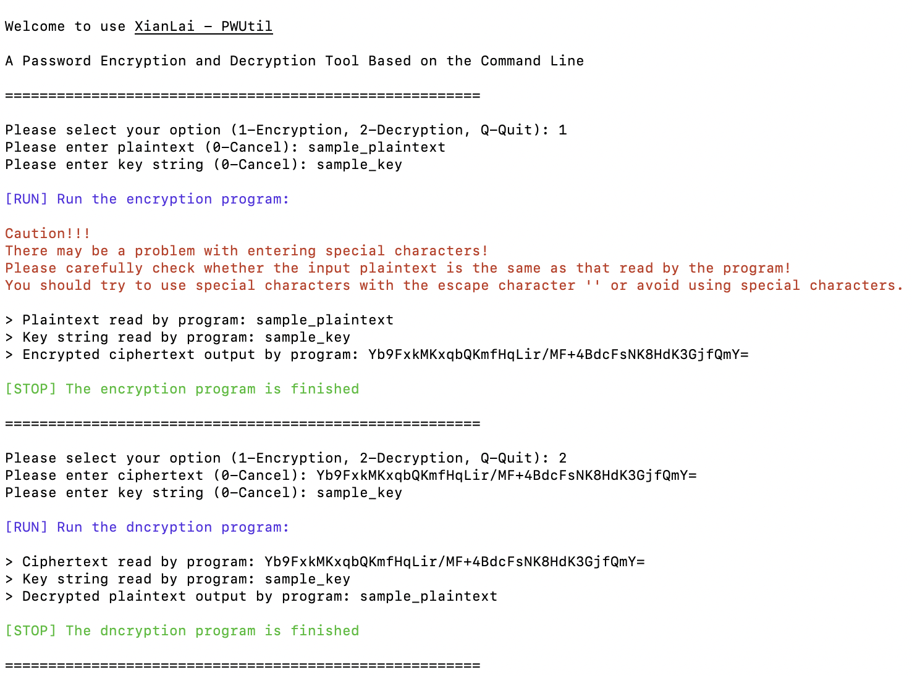

# XianLai - PWUtil

A Password Encryption and Decryption Tool Based on the Command Line

 

[中文](README.md) | English

Appreciate for your ⭐️Star⭐️

---

## Introduction

Everyone may use many passwords in life and work, such as bank card password, email password, computer unlock password, APP login password, website passwords and so on. It is really difficult to remember so many passwords, and some passwords are only used once for a long time, which increases the possibility of forgetting. In order to reduce the difficulty of memory, one way is to use only one or a few passwords everywhere. But in practice, it is not feasible, because each place has different rules for passwords. For example, some places need to contain special characters while others cannot. And you can't trust that the same password is safe in all places at the same time. Once it is leaked in one place, all other places that use this password are not safe.

Another way to reduce the difficulty of memory is to write down these passwords in a notebook or save them somewhere. In this case, the password needs to be encrypted and encoded, and the plaintext information should not be recorded directly. It is required that the encrypted code can be restored to the original password when needed. **XianLai - PWUtil** is such a tool that provides encryption and decryption functions based on the command line. Users can use command-line tools to run programs and perform quick operations according to prompts.

## Preview



## Usage

### Scripts Introduction

- `pwutil-zh`: Simplified chinese script, supports macOS and Linux
- `pwutil-en`: English script, supports macOS and Linux
- `pwutil-zh.bat`: Simplified chinese script, supports Windows
- `pwutil-en.bat`: English script, supports Windows

### Use in macOS / Linux Operating System (Recommended)

1. Make sure that Java / JDK running environment has been deployed (recommand 17 or newer).
2. Download program `pwutil.jar` and English script `pwutil-en` into the same directory.
3. Enter the directory of script, and execute the following command to grant the script executable permission:

```shell
chmod +x ./pwutil-en
```

4. Execute the following command to run the script, select the option according to the prompts, and then enter data to run the program:

```shell
./pwutil-en
```

### Use in Windows Operating System

1. Make sure that Java / JDK running environment has been deployed (recommand 17 or newer).
2. Download program `pwutil.jar` and English script `pwutil-en.bat` who supports Windows into the same directory.
3. Double click the script to execute, select the option according to the prompts, and then enter data to run the program.

